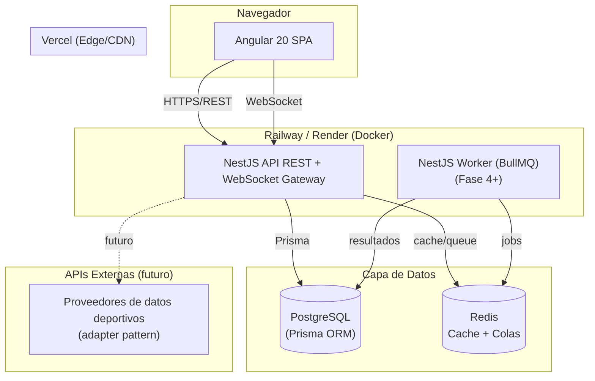

# Arquitectura

## 1. Visión general (C4 - Contenedores)



- **Frontend**: Angular 20 (standalone components, signals), Angular
  Material, ApexCharts, RxJS. SPA estática servida por Vercel.
- **Backend**: NestJS modular (Clean Architecture por módulo), API REST +
  Swagger + WebSocket gateway (predicciones en tiempo real, Fase 5).
- **Worker**: mismo código base, entrypoint distinto (`worker.ts`), procesa
  jobs pesados (Monte Carlo) vía BullMQ — Fase 4.
- **Datos**: PostgreSQL como única fuente de verdad; Redis para cache y colas
  (introducido en Fase 4, documentado desde ya).
- **Externo**: interfaz `SportsDataProvider` (puerto/adaptador) para futuras
  integraciones, sin implementación concreta aún.

## 2. Decisiones de stack

| Capa | Tecnología | Motivo |
|---|---|---|
| Frontend | Angular 20 standalone + Material + ApexCharts | Reduce boilerplate de módulos, ecosistema maduro de componentes UI |
| Estado/HTTP | RxJS + HttpClient + interceptors | Integración nativa con Angular |
| Backend | NestJS (Express) | Arquitectura modular, DI nativa, ideal para Clean Architecture |
| ORM | Prisma + PostgreSQL | Tipado fuerte, migraciones declarativas |
| Validación | class-validator / class-transformer | Estándar NestJS, DTOs declarativos |
| Logging | nestjs-pino (JSON estructurado) | Bajo overhead, agregable en plataformas cloud |
| Docs API | @nestjs/swagger (OpenAPI) | Documentación interactiva auto-generada |
| Cache/Colas | Redis + BullMQ (Fase 4) | Necesario para simulaciones Monte Carlo sin bloquear requests |
| Contenedores | Docker multi-stage (backend, frontend) | Builds reproducibles y deploy uniforme |
| CI | GitHub Actions (lint+test+build, ambos apps) | Calidad continua |
| Hosting | Vercel (frontend) / Railway o Render (backend+DB) | Despliegue independiente por proyecto |

## 3. Arquitectura del backend (Clean Architecture por módulo)

Cada módulo de dominio (`teams`, `matches`, ...) sigue la misma estructura en
capas:

```
modules/<modulo>/
├── domain/                # Entidades, interfaces de repositorio (puertos), tokens DI
├── application/
│   ├── dto/                # DTOs de entrada/salida (class-validator / class-transformer)
│   └── services/           # Casos de uso / lógica de negocio
├── infrastructure/
│   └── repositories/       # Implementación concreta (Prisma) de los puertos
├── presentation/
│   └── controllers/        # Controladores HTTP (Swagger)
└── <modulo>.module.ts      # Wiring: liga el token del repositorio a su implementación
```

- **Repository pattern vía DI**: el dominio define una interfaz
  (`ITeamRepository`) y un token de inyección (`TEAM_REPOSITORY`). El módulo
  liga ese token a `PrismaTeamRepository`. Los servicios dependen solo de la
  interfaz, nunca de Prisma directamente — facilita tests unitarios con
  mocks y permitiría cambiar de ORM sin tocar la capa de aplicación.
- **DTOs**: `CreateXDto` / `UpdateXDto` (con `PartialType`) para entrada,
  `XResponseDto` (`@Exclude`/`@Expose` + `plainToInstance`) para salida —
  evita exponer campos internos y garantiza contratos estables.
- **Servicios**: orquestan reglas de negocio (p. ej. unicidad de nombre de
  equipo, validación de que local ≠ visitante en un partido) y lanzan
  excepciones HTTP semánticas (`NotFoundException`, `ConflictException`,
  `BadRequestException`).
- **Controladores**: solo mapean rutas HTTP a servicios. Todos los endpoints
  son públicos, sin autenticación ni autorización.

Los módulos `teams`, `matches` y `competitions` son la implementación de
referencia completa de este patrón y sirven de plantilla para los módulos de
fases futuras (`predictions`, `simulations`, etc.).

## 4. Transversal (cross-cutting)

- **Configuración**: `ConfigModule` global con `configuration.ts` (tipado via
  `AppConfig`) y `env.validation.ts` (valida variables de entorno al boot).
- **Logging**: `nestjs-pino` configurado en `app.module.ts`
  (`LoggerModule.forRootAsync`), nivel `debug` en desarrollo / `info` en
  producción, formato `pino-pretty` solo fuera de producción. Un
  `LoggingInterceptor` (`APP_INTERCEPTOR`) registra cada request HTTP con
  método, ruta, status y duración.
- **Manejo de errores**: `AllExceptionsFilter` (`APP_FILTER`) centraliza
  todas las excepciones (HTTP, errores de Prisma `P2002`/`P2003`/`P2025`,
  errores genéricos) en una respuesta JSON consistente:
  `{ statusCode, error, message, path, timestamp }`.
- **Validación**: `ValidationPipe` global (`whitelist`,
  `forbidNonWhitelisted`, `transform`, `enableImplicitConversion`).
- **Seguridad HTTP**: `helmet()` + CORS restringido al origen configurado
  (`CORS_ORIGIN`).
- **Rate limiting**: `@nestjs/throttler` (`ThrottlerGuard` global, 100
  req/min por defecto).
- **Documentación**: Swagger (`@nestjs/swagger`) servido en
  `${API_PREFIX}/docs`.
- **Salud**: `GET /health` verifica conectividad a PostgreSQL
  (`SELECT 1` vía Prisma).

## 5. Frontend

- **Standalone components** (sin `NgModule`), enrutamiento con
  `provideRouter` y *lazy loading* por feature.
- **Layout**: `MainLayout` (toolbar + sidenav Material) para toda la
  aplicación.
- **Features**: `dashboard` (ranking Elo vía ApexCharts), `teams`,
  `competitions`, `matches`, `head-to-head` — cada una con sus propios
  componentes de lista/detalle/formulario y un servicio HTTP tipado contra
  los DTOs del backend.

## 6. Infraestructura, Docker, CI/CD

- `backend/Dockerfile`: build multi-stage `node:20-alpine` (deps → build →
  prod-deps → runtime), genera el cliente Prisma y ejecuta `dist/main.js`
  como usuario no-root.
- `frontend/Dockerfile` + `nginx.conf`: build Angular → servir estático (uso
  en docker-compose local; Vercel no usa este Dockerfile en producción).
- `docker-compose.yml` (raíz): `postgres`, `backend`, `frontend` para
  desarrollo local end-to-end. Redis/worker se añaden en Fase 4.
- `.github/workflows/ci.yml`: jobs paralelos `backend` (lint, prisma
  generate, jest unit + e2e con servicio postgres, build) y `frontend`
  (lint, unit tests, build).

## 7. Estrategia de escalabilidad

- **DB**: índices en FKs y `matchDate`; particionado nativo de PostgreSQL
  para `Match`/`MatchStatistic` por temporada cuando el volumen lo requiera;
  pool de conexiones (PgBouncer) y réplicas de lectura para
  dashboard/analítica.
- **Cache**: Redis para rankings, agregados de dashboard y resultados de
  predicción (TTL + invalidación al actualizar datos) — Fase 4+.
- **Cómputo pesado asíncrono**: BullMQ + Redis para Monte Carlo y recálculo
  masivo de Elo; workers escalables independientemente de la API.
- **Horizontal**: API stateless detrás del balanceador de Railway/Render;
  múltiples instancias.
- **Tiempo real multi-instancia**: adaptador Redis para Socket.io
  (`@socket.io/redis-adapter`) — Fase 5.
- **API**: paginación obligatoria en listados, `select`/`include` explícito
  en Prisma para evitar over-fetching, DTOs de respuesta whitelisted.
- **Observabilidad**: logging JSON (Pino) con duración por request, `/health`
  con verificación de base de datos.

## Roadmap (fases futuras)

- **Fase 2** (pendiente): carga de datos históricos reales (fuente de
  datos a definir).
- **Fase 3**: motor de predicción Elo+Poisson, módulo `predictions`,
  recálculo de Elo al finalizar partidos (domain event). Ver
  [PREDICTION_ENGINE.md](PREDICTION_ENGINE.md).
- **Fase 4**: Redis + BullMQ + worker, simulaciones Monte Carlo, módulo
  `simulations`.
- **Fase 5**: Dashboard completo (ApexCharts avanzado) + WebSocket en tiempo
  real.
- **Fase 6**: Panel admin completo (gestión usuarios/roles, audit log).
- **Fase 7**: Adaptador de APIs externas (`SportsDataProvider`).
- **Fase 8**: Hardening (cobertura e2e completa, particionado real, réplicas
  de lectura, configuración de despliegue Vercel/Railway en CI/CD).
