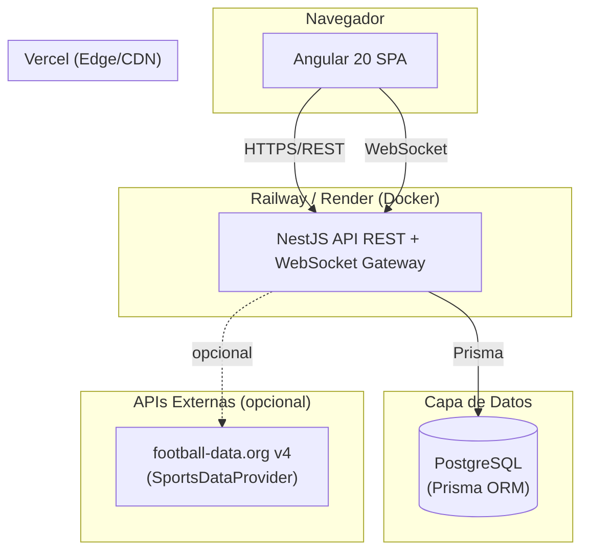

# Arquitectura

## 1. Visión general (C4 - Contenedores)



- **Frontend**: Angular 20 (standalone components, signals), Angular
  Material, ApexCharts, RxJS. SPA estática servida por Vercel.
- **Backend**: NestJS modular (Clean Architecture por módulo), API REST +
  Swagger + WebSocket gateway (predicciones y simulaciones en tiempo real).
- **Datos**: PostgreSQL como única fuente de verdad.
- **Externo (Fase 7)**: puerto `SportsDataProvider` (`modules/sync/domain`)
  con un adaptador concreto `FootballDataProvider` (football-data.org v4,
  activo cuando `FOOTBALL_DATA_API_KEY` está configurada) y un
  `NullSportsDataProvider` de respaldo (responde `503` si no hay proveedor
  configurado, caso por defecto). Endpoints `/admin/sync/*` (solo `ADMIN`)
  sincronizan competiciones/equipos/partidos hacia la BD vía `externalId`
  (upsert idempotente); si un partido sincronizado pasa a `FINISHED` con
  marcador, se recalcula Elo (`EloRatingService.applyMatchResult`, igual que
  `MatchesService.update`).
- **Simulaciones Monte Carlo (Fase 4)**: se ejecutan de forma síncrona dentro
  de la API (sin Redis/BullMQ/worker). Esa infraestructura queda reservada
  para una futura migración a ejecución asíncrona si el volumen de
  iteraciones lo requiere (ver [PREDICTION_ENGINE.md](PREDICTION_ENGINE.md)
  §4).

## 2. Decisiones de stack

| Capa | Tecnología | Motivo |
|---|---|---|
| Frontend | Angular 20 standalone + Material + ApexCharts | Reduce boilerplate de módulos, ecosistema maduro de componentes UI |
| Estado/HTTP | RxJS + HttpClient + interceptors | Integración nativa con Angular |
| Backend | NestJS (Express) | Arquitectura modular, DI nativa, ideal para Clean Architecture |
| ORM | Prisma + PostgreSQL | Tipado fuerte, migraciones declarativas |
| Validación | class-validator / class-transformer | Estándar NestJS, DTOs declarativos |
| Logging | nestjs-pino (JSON estructurado) | Bajo overhead, agregable en plataformas cloud |
| Docs API | @nestjs/swagger (OpenAPI) | Documentación interactiva auto-generada |
| Cache/Colas | Redis + BullMQ (futuro) | Reservado para una futura migración a ejecución asíncrona de simulaciones Monte Carlo; Fase 4 ejecuta de forma síncrona sin esta infraestructura |
| Adaptadores externos | @nestjs/axios + axios | Cliente HTTP para `SportsDataProvider`/`FootballDataProvider` (Fase 7) |
| Contenedores | Docker multi-stage (backend, frontend) | Builds reproducibles y deploy uniforme |
| CI | GitHub Actions (lint+test+build, ambos apps) | Calidad continua |
| Hosting | Vercel (frontend) / Railway o Render (backend+DB) | Despliegue independiente por proyecto |

## 3. Arquitectura del backend (Clean Architecture por módulo)

Cada módulo de dominio (`teams`, `matches`, ...) sigue la misma estructura en
capas:

```
modules/<modulo>/
├── domain/                # Entidades, interfaces de repositorio (puertos), tokens DI
├── application/
│   ├── dto/                # DTOs de entrada/salida (class-validator / class-transformer)
│   └── services/           # Casos de uso / lógica de negocio
├── infrastructure/
│   └── repositories/       # Implementación concreta (Prisma) de los puertos
├── presentation/
│   └── controllers/        # Controladores HTTP (Swagger)
└── <modulo>.module.ts      # Wiring: liga el token del repositorio a su implementación
```

- **Repository pattern vía DI**: el dominio define una interfaz
  (`ITeamRepository`) y un token de inyección (`TEAM_REPOSITORY`). El módulo
  liga ese token a `PrismaTeamRepository`. Los servicios dependen solo de la
  interfaz, nunca de Prisma directamente — facilita tests unitarios con
  mocks y permitiría cambiar de ORM sin tocar la capa de aplicación.
- **DTOs**: `CreateXDto` / `UpdateXDto` (con `PartialType`) para entrada,
  `XResponseDto` (`@Exclude`/`@Expose` + `plainToInstance`) para salida —
  evita exponer campos internos y garantiza contratos estables.
- **Servicios**: orquestan reglas de negocio (p. ej. unicidad de nombre de
  equipo, validación de que local ≠ visitante en un partido) y lanzan
  excepciones HTTP semánticas (`NotFoundException`, `ConflictException`,
  `BadRequestException`).
- **Domain events**: `MatchesService.update()` dispara, tras persistir el
  cambio, un recálculo de `eloRating` (`EloRatingService.applyMatchResult`,
  módulo `teams`) cuando un partido pasa a `FINISHED` con marcador definido —
  ver [PREDICTION_ENGINE.md](PREDICTION_ENGINE.md) §1.
- **Eventos en tiempo real**: `PredictionsService.generatePredictions()` y
  `SimulationsService.create()` emiten, tras persistir, los eventos
  `prediction.updated` y `simulation.progress` vía `EventEmitter2`
  (`@nestjs/event-emitter`, `EventEmitterModule.forRoot()` global). El módulo
  `realtime` (`EventsGateway`, namespace `/ws`) escucha esos eventos con
  `@OnEvent(...)` y los retransmite por Socket.io a todos los clientes
  conectados — desacopla los módulos de dominio del transporte WebSocket.
- **Controladores**: solo mapean rutas HTTP a servicios. Los endpoints de
  dominio (`teams`, `matches`, `competitions`, `predictions`, `simulations`,
  `stats`, `dashboard`) son públicos, sin autenticación ni autorización.
- **Autenticación y autorización (Fase 6)**: `OptionalJwtAuthGuard`
  (`APP_GUARD` global, registrado en `AuthModule`) decodifica el header
  `Authorization: Bearer <token>` si está presente y rellena
  `request.user`, pero nunca bloquea la request — así los endpoints públicos
  siguen funcionando sin sesión, y `AuditInterceptor` puede atribuir
  mutaciones a un usuario cuando lo hay. Las rutas que requieren sesión
  (`GET /auth/me`, `/admin/*`) añaden `@UseGuards(JwtAuthGuard, RolesGuard)`
  y, si aplica, `@Roles(Role.ADMIN)` (leído por `RolesGuard` vía
  `Reflector`); `@CurrentUser()` extrae `request.user` en el controlador.
- **Audit log (Fase 6)**: `AuditInterceptor` (`APP_INTERCEPTOR` global,
  registrado en `AuditModule`) registra en `AuditLog` toda mutación
  (`POST`/`PATCH`/`PUT`/`DELETE`) fuera de `/auth/*` y `/admin/*`, con
  `userId`/`userEmail` (`null` si la request era anónima), `method`, `path`,
  `entityType`, `entityId` y `statusCode`.

Los módulos `teams`, `matches` y `competitions` son la implementación de
referencia completa de este patrón y sirven de plantilla; `predictions`
(Fase 3) y `simulations` (Fase 4) ya están implementados siguiendo la misma
estructura.

## 4. Transversal (cross-cutting)

- **Configuración**: `ConfigModule` global con `configuration.ts` (tipado via
  `AppConfig`) y `env.validation.ts` (valida variables de entorno al boot).
- **Logging**: `nestjs-pino` configurado en `app.module.ts`
  (`LoggerModule.forRootAsync`), nivel `debug` en desarrollo / `info` en
  producción, formato `pino-pretty` solo fuera de producción. Un
  `LoggingInterceptor` (`APP_INTERCEPTOR`) registra cada request HTTP con
  método, ruta, status y duración.
- **Manejo de errores**: `AllExceptionsFilter` (`APP_FILTER`) centraliza
  todas las excepciones (HTTP, errores de Prisma `P2002`/`P2003`/`P2025`,
  errores genéricos) en una respuesta JSON consistente:
  `{ statusCode, error, message, path, timestamp }`.
- **Validación**: `ValidationPipe` global (`whitelist`,
  `forbidNonWhitelisted`, `transform`, `enableImplicitConversion`).
- **Seguridad HTTP**: `helmet()` + CORS restringido al origen configurado
  (`CORS_ORIGIN`).
- **Autenticación**: JWT (`@nestjs/jwt` + `passport-jwt`), contraseñas
  hasheadas con `bcrypt`. Todos los endpoints siguen siendo públicos
  **excepto** `GET /auth/me` y `/admin/*` (ver §3).
- **Rate limiting**: `@nestjs/throttler` (`ThrottlerGuard` global, 100
  req/min por defecto).
- **Documentación**: Swagger (`@nestjs/swagger`) servido en
  `${API_PREFIX}/docs`.
- **Salud**: `GET /health` verifica conectividad a PostgreSQL
  (`SELECT 1` vía Prisma).

## 5. Frontend

- **Standalone components** (sin `NgModule`), enrutamiento con
  `provideRouter` y *lazy loading* por feature.
- **Layout**: `MainLayout` (toolbar + sidenav Material) para toda la
  aplicación.
- **Features**: `dashboard` (resumen agregado: totales, ranking Elo y
  partidos por estado vía ApexCharts, próximos partidos/resultados
  recientes, ranking Elo paginado y actividad en tiempo real vía WebSocket),
  `teams`, `competitions` (incluye gestión de grupos y la card "Simular
  torneo"), `matches` (incluye `match-detail` con generación de predicciones
  Elo/Poisson/Ensemble), `head-to-head`, `simulations` (página de resultados
  de una simulación Monte Carlo), `auth` (login), `admin` (gestión de
  usuarios/roles y audit log, solo `ADMIN`) — cada una con sus propios
  componentes de lista/detalle/formulario y un servicio HTTP tipado contra
  los DTOs del backend.
- **Autenticación (Fase 6)**: `AuthService` guarda el JWT en `localStorage` y
  expone `currentUser`/`isAuthenticated`/`isAdmin` como signals (decodifica
  el JWT al cargar la página para restaurar la sesión). `authInterceptor`
  añade el header `Authorization` a las requests salientes y desloguea al
  recibir `401`. `adminGuard` (`CanActivateFn`) protege `/admin/*`.
- **Tiempo real**: `RealtimeService` (`socket.io-client`, conecta a
  `${wsUrl}/ws`) expone `onPredictionUpdated()`/`onSimulationProgress()` como
  `Observable`; el dashboard se suscribe con
  `takeUntilDestroyed()` (`@angular/core/rxjs-interop`) para alimentar la
  card "Actividad en tiempo real".

## 6. Infraestructura, Docker, CI/CD

- `backend/Dockerfile`: build multi-stage `node:20-alpine` (deps → build →
  prod-deps → runtime), genera el cliente Prisma y ejecuta `dist/main.js`
  como usuario no-root.
- `frontend/Dockerfile` + `nginx.conf`: build Angular → servir estático (uso
  en docker-compose local; Vercel no usa este Dockerfile en producción).
- `docker-compose.yml` (raíz): `postgres`, `backend`, `frontend` para
  desarrollo local end-to-end. Redis/worker quedan reservados para una futura
  migración a ejecución asíncrona (no requeridos por Fase 4).
- `.github/workflows/ci.yml`: jobs paralelos `backend` (lint, prisma
  generate, jest unit + e2e con servicio postgres, build) y `frontend`
  (lint, unit tests, build).
- **Despliegue (Fase 8)**: `frontend/vercel.json` (build `npm run build`,
  `outputDirectory: dist/frontend/browser`, framework `angular`, rewrite SPA
  `/(.*) -> /index.html`, equivalente al `try_files` de `nginx.conf`) y
  `backend/railway.toml` (build con el `Dockerfile` existente, `startCommand:
  node dist/main.js`, healthcheck `/api/v1/health`, `releaseCommand: npx
  prisma db push --skip-generate` para mantener el esquema sincronizado en
  cada deploy). Dos jobs adicionales en `ci.yml`, `deploy-frontend` y
  `deploy-backend`, corren solo en `push` a `master` tras `frontend`/`backend`
  respectivamente: hacen `checkout` y, si existen los secrets
  correspondientes (`VERCEL_TOKEN`/`VERCEL_ORG_ID`/`VERCEL_PROJECT_ID` para
  Vercel, `RAILWAY_TOKEN` para Railway), despliegan a producción. El paso de
  despliegue usa un `if` a nivel de step sobre `secrets.X != ''`; sin esos
  secrets configurados en el repositorio (caso por defecto), el paso queda
  *skipped* y el job termina en verde — no rompe CI. Ver "Despliegue" en
  [README.md](../README.md) para el alta manual de los proyectos en
  Vercel/Railway y la creación de los secrets.

## 7. Estrategia de escalabilidad

- **DB**: índices en FKs y `matchDate`; particionado nativo de PostgreSQL
  para `Match`/`MatchStatistic` por temporada cuando el volumen lo requiera;
  pool de conexiones (PgBouncer) y réplicas de lectura para
  dashboard/analítica.
  - **Particionado (diferido)**: con ~2500 partidos (ver
    [DATABASE.md](DATABASE.md)) no es necesario hoy. Diseño previsto cuando el
    volumen alcance el orden de decenas/cientos de miles de filas:
    convertir `matches` y `match_statistics` en tablas particionadas por
    rango (`PARTITION BY RANGE`) sobre `matchDate`, con una partición por
    temporada/año (`matches_2026`, `matches_2027`, ...). Como el flujo actual
    usa `prisma db push` (sin migraciones formales), esto requeriría una
    migración SQL nativa puntual (`prisma migrate` con SQL crudo) para
    recrear las tablas como particionadas y migrar los datos existentes;
    las particiones nuevas se crearían por adelantado (cron o script de
    mantenimiento) antes de que empiece cada temporada.
  - **Réplicas de lectura (diferido)**: variable de entorno opcional
    `DATABASE_REPLICA_URL`. Cuando esté configurada, un segundo
    `PrismaClient` (p. ej. `PrismaReadService`, mismo patrón que
    `PrismaService`) apuntaría a la réplica y sería inyectado en los
    repositorios de lectura más pesados (`dashboard`, `stats`). Si la
    variable no está configurada, `PrismaReadService` reutiliza la conexión
    primaria (mismo enfoque Null-Object que `NullSportsDataProvider`, Fase
    7) — sin cambios de comportamiento hasta que exista una réplica real.
- **Cache**: Redis para rankings, agregados de dashboard y resultados de
  predicción (TTL + invalidación al actualizar datos) — futuro.
- **Cómputo pesado asíncrono**: BullMQ + Redis para Monte Carlo y recálculo
  masivo de Elo; workers escalables independientemente de la API — futuro
  (Fase 4 ejecuta las simulaciones de forma síncrona).
- **Horizontal**: API stateless detrás del balanceador de Railway/Render;
  múltiples instancias.
- **Tiempo real multi-instancia**: adaptador Redis para Socket.io
  (`@socket.io/redis-adapter`) — necesario solo si la API escala a múltiples
  instancias; el `EventsGateway` actual asume una sola instancia — futuro.
- **API**: paginación obligatoria en listados, `select`/`include` explícito
  en Prisma para evitar over-fetching, DTOs de respuesta whitelisted.
- **Observabilidad**: logging JSON (Pino) con duración por request, `/health`
  con verificación de base de datos.

## Roadmap

- **Fase 8 (cerrada)**: Hardening. Cobertura e2e completa de las operaciones
  CRUD de `teams`/`matches`/`competitions` (detalle, actualización,
  eliminación, casos de error 400/404/409) y configuración de despliegue
  Vercel/Railway en CI/CD (ver §6). El particionado real de
  `matches`/`match_statistics` y las réplicas de lectura quedan diseñados y
  diferidos (ver §7) hasta que el volumen de datos lo justifique.

No quedan fases pendientes sin diseño documentado.
