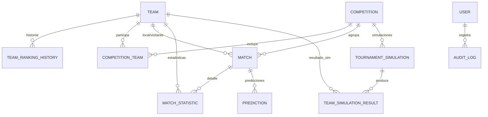

# Modelo de Datos

Esquema completo definido en [`backend/prisma/schema.prisma`](../backend/prisma/schema.prisma).
Incluye todas las entidades del dominio desde la Fase 1; los módulos NestJS
`predictions` (Fase 3) y `simulations` (Fase 4) ya están implementados sobre
este mismo esquema.

## Diagrama Entidad-Relación



## Enums

| Enum | Valores |
|---|---|
| `Confederation` | `UEFA`, `CONMEBOL`, `CONCACAF`, `CAF`, `AFC`, `OFC` |
| `CompetitionType` | `WORLD_CUP`, `CONTINENTAL`, `QUALIFIER`, `FRIENDLY`, `CLUB` |
| `CompetitionStatus` | `UPCOMING`, `ONGOING`, `FINISHED` |
| `MatchStage` | `GROUP_STAGE`, `ROUND_OF_16`, `QUARTER_FINAL`, `SEMI_FINAL`, `THIRD_PLACE`, `FINAL`, `QUALIFIER`, `FRIENDLY` |
| `MatchStatus` | `SCHEDULED`, `LIVE`, `FINISHED`, `POSTPONED`, `CANCELLED` |
| `PredictionModel` | `ELO`, `POISSON`, `MONTE_CARLO`, `ENSEMBLE` |
| `SimulationStatus` | `PENDING`, `RUNNING`, `COMPLETED`, `FAILED` |
| `Role` | `ADMIN`, `EDITOR` |

## Entidades

### Team (`teams`)

Selecciones nacionales. Base del motor de predicción (`eloRating`).

| Campo | Tipo | Notas |
|---|---|---|
| `id` | `String (uuid)` | PK |
| `name` | `String` | único |
| `shortName` | `String(3)` | código de 3 letras |
| `country` | `String` | |
| `confederation` | `Confederation` | |
| `logoUrl` | `String?` | |
| `fifaRanking` | `Int?` | |
| `fifaRankingPoints` | `Float?` | |
| `eloRating` | `Float` | default `1500` |
| `foundedYear` | `Int?` | |
| `createdAt` / `updatedAt` | `DateTime` | |

Relaciones: `rankingHistory` (1:N), `competitionEntries` (1:N),
`homeMatches`/`awayMatches` (1:N vía `Match`), `matchStatistics` (1:N),
`simulationResults` (1:N). Índice: `[confederation]`.

### TeamRankingHistory (`team_ranking_history`)

Serie temporal de ranking FIFA y Elo, usada para gráficos de tendencia en el
dashboard.

| Campo | Tipo | Notas |
|---|---|---|
| `id` | `String (uuid)` | PK |
| `teamId` | `String` | FK -> `Team`, `onDelete: Cascade` |
| `fifaRanking` | `Int?` | |
| `fifaPoints` | `Float?` | |
| `eloRating` | `Float` | |
| `recordedAt` | `DateTime` | |

Índice: `[teamId, recordedAt]`.

### Competition (`competitions`)

Agrupa partidos (Mundial, eliminatorias, amistosos, etc.).

| Campo | Tipo | Notas |
|---|---|---|
| `id` | `String (uuid)` | PK |
| `name` | `String` | |
| `type` | `CompetitionType` | |
| `season` | `String` | p. ej. `"2026"` |
| `startDate` / `endDate` | `DateTime` | |
| `status` | `CompetitionStatus` | default `UPCOMING` |
| `createdAt` / `updatedAt` | `DateTime` | |

Relaciones: `teams` (1:N vía `CompetitionTeam`), `matches` (1:N),
`simulations` (1:N). Índice: `[type, season]`.

### CompetitionTeam (`competition_teams`)

Tabla de unión equipo-competición (fase de grupos, *seed*).

| Campo | Tipo | Notas |
|---|---|---|
| `id` | `String (uuid)` | PK |
| `competitionId` | `String` | FK -> `Competition`, `onDelete: Cascade` |
| `teamId` | `String` | FK -> `Team`, `onDelete: Cascade` |
| `groupName` | `String?` | p. ej. `"Grupo A"` |
| `seed` | `Int?` | cabeza de serie |

Único: `[competitionId, teamId]`.

### Match (`matches`)

Partido entre dos selecciones dentro de una competición.

| Campo | Tipo | Notas |
|---|---|---|
| `id` | `String (uuid)` | PK |
| `competitionId` | `String` | FK -> `Competition`, `onDelete: Cascade` |
| `homeTeamId` / `awayTeamId` | `String` | FK -> `Team` (relaciones `HomeTeam`/`AwayTeam`) |
| `matchDate` | `DateTime` | |
| `venue` / `city` | `String?` | |
| `stage` | `MatchStage` | |
| `round` | `String?` | p. ej. `"Jornada 1"` |
| `homeGoals` / `awayGoals` | `Int?` | `null` hasta jugarse |
| `status` | `MatchStatus` | default `SCHEDULED` |
| `createdAt` / `updatedAt` | `DateTime` | |

Relaciones: `statistics` (1:N), `predictions` (1:N). Índices:
`[competitionId]`, `[homeTeamId]`, `[awayTeamId]`, `[matchDate]`.

> Regla de negocio (capa de aplicación): `homeTeamId !== awayTeamId`.

### MatchStatistic (`match_statistics`)

Estadísticas de un equipo en un partido concreto.

| Campo | Tipo | Notas |
|---|---|---|
| `id` | `String (uuid)` | PK |
| `matchId` | `String` | FK -> `Match`, `onDelete: Cascade` |
| `teamId` | `String` | FK -> `Team`, `onDelete: Cascade` |
| `possession` | `Float?` | porcentaje 0-100 |
| `shotsTotal` / `shotsOnTarget` | `Int?` | |
| `corners` / `fouls` | `Int?` | |
| `yellowCards` / `redCards` | `Int?` | |
| `passes` | `Int?` | |
| `passAccuracy` | `Float?` | porcentaje 0-100 |
| `offsides` | `Int?` | |

Único: `[matchId, teamId]` (upsert por equipo participante).

### Prediction (`predictions`)

Resultado de un modelo de predicción para un partido. Se puebla vía
`POST /predictions/matches/:id/generate` (ver [API.md](API.md) y
[PREDICTION_ENGINE.md](PREDICTION_ENGINE.md)).

| Campo | Tipo | Notas |
|---|---|---|
| `id` | `String (uuid)` | PK |
| `matchId` | `String` | FK -> `Match`, `onDelete: Cascade` |
| `model` | `PredictionModel` | `ELO` / `POISSON` / `MONTE_CARLO` / `ENSEMBLE` |
| `homeWinProbability` / `drawProbability` / `awayWinProbability` | `Float` | suman ~1 |
| `predictedHomeGoals` / `predictedAwayGoals` | `Float?` | esperanza de goles (Poisson) |
| `generatedAt` | `DateTime` | default `now()` |

Índice: `[matchId, model]`. Sin restricción de unicidad: cada generación
agrega una nueva fila (historial); `GET /predictions/matches/:id` devuelve
solo la más reciente por `model`.

### TournamentSimulation (`tournament_simulations`)

Ejecución de una simulación Monte Carlo de un torneo completo. Se crea
mediante `POST /simulations` (ver [API.md](API.md) y
[PREDICTION_ENGINE.md](PREDICTION_ENGINE.md) §4), que ejecuta la simulación
de forma síncrona dentro del request y persiste la fila ya con
`status = COMPLETED`.

| Campo | Tipo | Notas |
|---|---|---|
| `id` | `String (uuid)` | PK |
| `competitionId` | `String` | FK -> `Competition`, `onDelete: Cascade` |
| `iterations` | `Int` | 100-5000, default 1000 |
| `status` | `SimulationStatus` | `COMPLETED` al persistirse (ejecución síncrona); `PENDING`/`RUNNING`/`FAILED` reservados para una futura ejecución asíncrona |
| `startedAt` / `completedAt` | `DateTime?` | se fijan ambos al persistirse |
| `createdAt` | `DateTime` | |

Relaciones: `teamResults` (1:N). Índice: `[competitionId]`.

### TeamSimulationResult (`team_simulation_results`)

Probabilidades agregadas por equipo de una simulación.

| Campo | Tipo | Notas |
|---|---|---|
| `id` | `String (uuid)` | PK |
| `simulationId` | `String` | FK -> `TournamentSimulation`, `onDelete: Cascade` |
| `teamId` | `String` | FK -> `Team`, `onDelete: Cascade` |
| `groupStageProbability` | `Float` | fracción de iteraciones entre los `QUALIFIERS_PER_GROUP` (2) primeros del grupo |
| `roundOf16Probability` / `quarterFinalProbability` / `semiFinalProbability` / `finalProbability` | `Float?` | fracción de iteraciones en las que el equipo alcanzó esa ronda; `null` si el bracket de la competición no llega a esa ronda (p. ej. con 4 clasificados solo existen semifinal y final) |
| `championProbability` | `Float` | fracción de iteraciones ganadas (0 si nunca clasificó o nunca ganó) |
| `expectedPosition` | `Float?` | posición media dentro del grupo a lo largo de las iteraciones (`1` = siempre primero) |

Único: `[simulationId, teamId]`.

### User (`users`)

Cuentas con acceso a `/admin/*` (Fase 6). Se crean/gestionan vía
`/api/v1/admin/users`.

| Campo | Tipo | Notas |
|---|---|---|
| `id` | `String (uuid)` | PK |
| `email` | `String` | único |
| `passwordHash` | `String` | bcrypt, 10 salt rounds |
| `name` | `String` | |
| `role` | `Role` | default `EDITOR` |
| `isActive` | `Boolean` | default `true` |
| `createdAt` / `updatedAt` | `DateTime` | |

Relaciones: `auditLogs` (1:N). Reglas de negocio (capa de aplicación): no se
puede eliminar/desactivar ni degradar de rol al propio usuario, ni dejar el
sistema sin ningún `ADMIN` activo.

### AuditLog (`audit_logs`)

Historial de mutaciones (`POST`/`PATCH`/`PUT`/`DELETE`) registrado
automáticamente por `AuditInterceptor` (Fase 6) para todas las rutas excepto
`/auth/*` y `/admin/*`.

| Campo | Tipo | Notas |
|---|---|---|
| `id` | `String (uuid)` | PK |
| `userId` | `String?` | FK -> `User`, `onDelete: SetNull`; `null` si la mutación fue anónima |
| `userEmail` | `String?` | snapshot del email en el momento de la mutación (persiste aunque se borre el usuario) |
| `method` | `String` | `POST` / `PATCH` / `PUT` / `DELETE` |
| `path` | `String` | ruta completa de la request |
| `entityType` | `String` | primer segmento de la ruta, p. ej. `teams` |
| `entityId` | `String?` | `request.params.id` si existe |
| `statusCode` | `Int` | |
| `createdAt` | `DateTime` | default `now()` |

Índices: `[createdAt]`, `[userId]`.

## Migraciones y seed

```bash
cd backend
npx prisma migrate dev      # crea/actualiza el esquema en PostgreSQL
npm run seed                 # datos iniciales (equipos, competición y partidos demo)
npx prisma studio             # explorador visual de datos
```

El seed (`backend/prisma/seed.ts`) crea 18 selecciones nacionales con su
`eloRating`/`fifaRanking` inicial y su historial de ranking, el Mundial 2026
como competición demo (`SCHEDULED`, fase de grupos) y el **historial real de
partidos** entre esas 18 selecciones: ~2465 partidos `FINISHED` (1902-2026),
importados desde `backend/prisma/data/historical-matches.csv` (dataset
público `martj42/international_results`, CC0), agrupados en 44 competiciones
(una por torneo: `FIFA World Cup`, `Copa América`, `UEFA Euro`, `Friendly`,
etc.). Esto alimenta los endpoints de `teams`, `matches`, `competitions`
(`standings`) y `stats` (`team-form`, `head-to-head`) con datos reales.

El seed también crea (upsert) un usuario `ADMIN` para `/admin/*` (Fase 6),
con `email`/`password` tomados de las variables de entorno
`SEED_ADMIN_EMAIL` / `SEED_ADMIN_PASSWORD` (defaults de desarrollo:
`admin@worldcup-analytics.local` / `Admin123!`). **Cambiar estos valores en
producción.**
